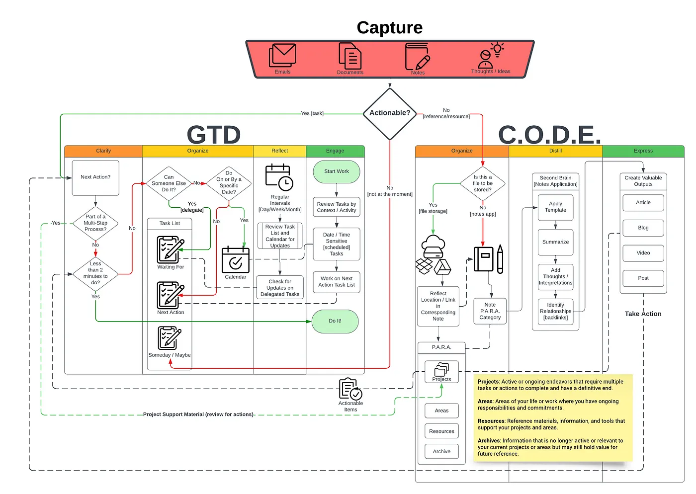
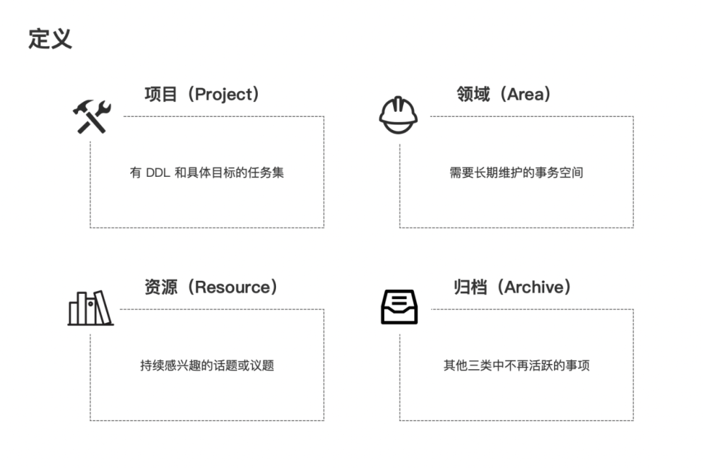

# 一周格致随想（第32期）第二大脑：有效的信息处理方法

之前写过如何认识信息背后的事实真相？信息素养，掌握生活中认知怀疑六项基础原则。今天我们主题是围绕如何进行有效的处理信息，详细对两个流行生产效率框架：Getting Things Done (GTD) and CODE (Capture, Organize, Distill, Express)进行阐释，同时还将补充讨论PARA信息组织（Projects，Areas，Resources，Archive）方法。

首先要有这样的认识转变，大脑是用来思考处理信息的，不是用于存储信息的，所以要有一个好的第二大脑负责信息的有效存储、组织、提炼等相关工作，减轻大脑信息计算处理的有效负荷。

下面是对这些框架和系统的概述介绍，因此已经熟悉掌握它们的人，可以直接跳过这篇内容。

第一，让我们先从David Allen开发的GTD生产效率框架开始。GTD是基于五项关键原则：捕获（Capture）、澄清（Clarify）、组织（Organize）、审视（Reflect）和参与（Engage），进行信息的有效任务过程管理。

捕获（Capture）: 第一步是收集和记录所有任务、想法、点子和承诺。您可以使用便签和笔记本、APP或任何适合您的方式来做到这一点。目的是捕捉收集所有一切信息，以便没有任何东西从裂缝中溜走，而忽视掉。

澄清（Clarify）: 一旦你捕获了所有内容，是时候澄清每个项目的含义和后续步骤了。审查每项任务，并确定其意义、目的和预期结果。询问诸如“这是什么？”，“为什么要做？”，“下一步行动是什么？”，“什么时间完成？”之类的问题或者“我可以在两分钟内完成这项任务吗？”，帮助您确定可操作的步骤并有效地确定优先级。

组织（Organize）: 当你澄清完任务后，就可以系统地组织它们。这涉及创建一个可信的系统来管理您的任务。您可以使用分类（categories）、标记（label）、标签（tags）或文件夹将类似的任务分组在一起。目的是拥有一个清晰的结构和组织，以便在需要时轻松访问。

审视（Reflect）: 定期地审查和回顾任务、项目是至关重要的。花点时间退后一步思考，评估你的进展，并根据需要进行调整响应。审视可以帮助您保持视角，与您的目标保持一致，并确定需要改进的领域。

参与（Engage）: 最后一步，是时候采取行动并完成任务了。一旦你捕获、澄清、组织和审视，就投入行动并完成事情。可以专注于手头的任务，消除干扰，并保持积极主动的方法。

通过五个步骤：捕获（Capture）、澄清（Clarify）、组织（Organize）、审视（Reflect）和参与（Engage）的GTD原则，您可以高效地管理任务，消除压力，并提高生产力。这些步骤原则可以帮助你保持有序、做出明智的决策和实现预期结果达成目标。

第二，我们进一步详细介绍下Tiago Forte的构建第二大脑（Building a Second Brain）方法中获得的CODE框架。CODE代表Capture（捕获）、Organize（组织）、Distill（提炼）和Express（表达）。这个生产力框架可以帮助你将个人知识转化为有价值的资产：

Capture（捕获）：第一步是从各种来源，比如博客、文章、书籍、对话或个人经验等，收集信息、想法和见解。要高效便捷地捕获这些输入是最关键的，你可以用记笔记、书签或录音等方法。

Organize（组织）：一旦你收集了大量信息后，就需要把它们组织起来。你可以使用标签、链接、文件夹或数据库等工具，对捕获的知识进行结构化和分类。创建一个整洁连贯的知识系统，可以快速检索和轻松查看自己的知识库。

Distill（提炼）：提炼阶段的重点是从你捕获的信息中提取最有价值和可操作的见解。你可以查看和总结自己的笔记，突出关键点，识别模式，并提取关键概念。目标是把复杂的信息提炼成简洁而有意义的金点子，让容易理解和应用。

Express（表达）：最后一步是与他人分享您提炼的知识，或用它来创造有价值的产出。你可以撰写博客文章、文章、报告、创建演示文稿、视频或播客。表达你的见解不仅增强了你自己的理解，还有助于更广泛的知识共享社区。

通过遵循CODE框架，可以让你不断地对知识进行加工和改进，从而提高知识的质量和可用性。也可以让你适应不同层次和粒度的信息需求，从而提高知识的灵活性和适应性。你可以有效地将知识转化为可操作的资产，并提高你的个人生产力，以及品牌价值。

第三，在第二大脑方法中，Tiago Forte也介绍了一个用于有效组织和分类信息的PARA框架：

项目（Projects）：项目组件代表那些需要完成多个步骤或行动的结果导向的工作。这些任务有明确的目标、截止日期或可交付成果。高效管理项目对于集中精力和取得成功至关重要。

领域（Areas）：领域组件包括您生活中的不同领域、角色或责任范围。它可以是个人发展、与工作相关的责任、健康和健身或创造性追求等。将项目和任务分组到相关领域，可以帮助你有效的管理和组织。

资源（Resources）：资源组件包括支持您的工作和项目的参考材料、信息和工具。它可以是文章、书籍、研究论文、网站或任何其他有价值的知识来源。资源在为决策提供信息、解决问题和产生想法方面发挥着至关重要的作用。

存档（Archive）：存档组件是您存储未积极使用但可能对未来参考有价值的信息和内容的地方。它是过去项目、已完成的任务或您想要保留的信息的存储库。归档有助于维护一个没有杂乱的工作空间，并专注于当前的优先事项。

通过将信息分类为项目、领域、资源和存档，PARA框架提供了一个在知识管理系统中组织和管理信息的结构化方法。这有助于您轻松定位和访问相关内容，保持清晰度，并确保不遗漏任何重要内容。

总之，通过建立第二大脑系统，采用GTD、CODE和PARA等生产力框架，可以显著提高您信息处理，管理任务、获取知识和保持井然有序的能力。这些框架提供了经过时间考验的原则、指南和最佳实践，您可以根据自己的独特需求进行定制。请记住，实施这些框架最初可能看起来有点困难，但通过实践，它们会变得直观，使您能够专注于真正重要的事情——实现您的目标并产生积极影响。

一个强大的第二大脑系统，将是你更上一层楼的台阶基石。不正是您期许值得拥有的吗？

注：文章题图来源网络。

2023/10/22
